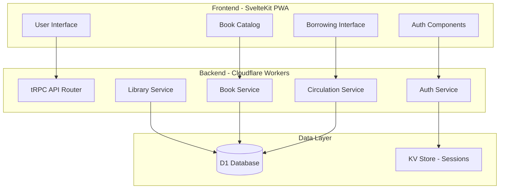

# Design Document - Release 1: The Minimum Viable Product (MVP)

## Overview

Release 1 MVP establishes the foundational architecture and core circulation workflow for OpenBookCorner. This release validates the essential book borrowing and returning loop through a minimal but complete multi-tenant application deployed to a single early-adopter tenant.

The design prioritizes architectural correctness over feature richness, ensuring that the multi-tenant foundation, authentication system, and core domain models are properly established for future releases. The MVP focuses on proving the core value proposition: digitizing the book borrowing workflow without physical scanning requirements.

### Key Design Principles

- **Multi-tenancy First**: Complete data isolation architecture from day one
- **Minimal Viable Features**: Essential functionality only, no advanced features
- **Manual Operations**: Development team handles tenant and admin setup
- **Simple UI**: Functional interfaces without advanced UX patterns
- **No Physical Integration**: Pure digital workflow, no barcode scanning
- **Cloudflare Edge**: Serverless architecture optimized for performance and cost

## Architecture

### High-Level System Architecture



### Domain-Driven Design Structure

The MVP implements a simplified version of the full DDD architecture, focusing on three core bounded contexts:

#### 1. Library Management Context
**Responsibility**: Multi-tenant foundation, user authentication, and basic access control

**Key Components:**
- Library aggregate (tenant management)
- User aggregate (authentication and roles)
- Email-based passwordless authentication
- Manual tenant and admin setup

#### 2. Catalog Management Context  
**Responsibility**: Book inventory and simple catalog display

**Key Components:**
- Book aggregate (title, author, ISBN, availability)
- Manual book entry workflow
- Simple list-based catalog view
- No search or pagination in MVP

#### 3. Circulation Context
**Responsibility**: Core borrowing and returning workflow

**Key Components:**
- Borrow transaction aggregate
- Digital-only borrowing (no scanning)
- Due date management (14-day default)
- Simple "My Books" interface

## Components and Interfaces

### 1. Authentication System

**Design Decision**: Email-based passwordless authentication with verification codes
**Rationale**: Eliminates password management complexity while providing secure access through corporate email verification

```typescript
// Authentication Flow
interface AuthenticationService {
  sendVerificationCode(email: string): Promise<void>;
  verifyCode(email: string, code: string): Promise<AuthResult>;
  validateSession(sessionId: string): Promise<User | null>;
}

interface AuthResult {
  success: boolean;
  user?: User;
  sessionToken?: string;
  error?: string;
}

interface User {
  id: string;
  email: string;
  name: string;
  libraryId: string;
  role: 'library_admin' | 'library_reader';
  isActive: boolean;
}
```

**Implementation Approach:**
- Lucia Auth for session management
- Cloudflare KV for verification code storage (5-minute TTL)
- Corporate email domain validation for tenant association
- Manual user creation by development team for MVP

### 2. Multi-Tenant Library Management

**Design Decision**: Application-level tenant isolation with library-scoped data access
**Rationale**: Ensures complete data separation while maintaining simple database schema

```typescript
interface Library {
  id: string;
  name: string;
  emailDomains: string[];
  settings: LibrarySettings;
  isActive: boolean;
  createdAt: Date;
}

interface LibrarySettings {
  borrowingPeriodDays: number; // Default: 14
  maxBooksPerReader: number;   // Default: 5
  allowExtensions: boolean;    // Default: false
}

interface LibraryService {
  createLibrary(name: string, emailDomains: string[]): Promise<Library>;
  findByEmailDomain(email: string): Promise<Library | null>;
  validateUserAccess(userId: string, libraryId: string): Promise<boolean>;
}
```

**Tenant Isolation Strategy:**
- All database queries include `libraryId` filter
- Middleware enforces tenant context on all API calls
- User sessions include library scope
- Cross-tenant operations explicitly forbidden

### 3. Book Catalog Management

**Design Decision**: Simple manual book entry with minimal metadata
**Rationale**: Focuses on core functionality without external API dependencies or complex metadata management

```typescript
interface Book {
  id: string;
  isbn: string;
  title: string;
  author: string;
  libraryId: string;
  isAvailable: boolean;
  createdAt: Date;
  updatedAt: Date;
}

interface BookService {
  addBook(book: CreateBookRequest): Promise<Book>;
  getLibraryCatalog(libraryId: string): Promise<Book[]>;
  updateAvailability(bookId: string, isAvailable: boolean): Promise<void>;
}

interface CreateBookRequest {
  isbn: string;
  title: string;
  author: string;
  libraryId: string;
}
```

**Catalog Display Features:**
- Simple list view (no pagination in MVP)
- Display: title, author, availability status
- No search functionality in MVP
- Real-time availability updates
- Librarian-only book addition

### 4. Circulation Management

**Design Decision**: Digital-only borrowing workflow with automatic due dates
**Rationale**: Eliminates physical scanning complexity while providing complete borrowing tracking

```typescript
interface BorrowTransaction {
  id: string;
  bookId: string;
  userId: string;
  libraryId: string;
  borrowedAt: Date;
  dueDate: Date;
  returnedAt?: Date;
  isOverdue: boolean;
}

interface CirculationService {
  borrowBook(bookId: string, userId: string): Promise<BorrowTransaction>;
  returnBook(transactionId: string): Promise<void>;
  getUserBorrowedBooks(userId: string): Promise<BorrowedBook[]>;
  checkOverdueBooks(libraryId: string): Promise<BorrowTransaction[]>;
}

interface BorrowedBook {
  transactionId: string;
  book: Book;
  borrowedAt: Date;
  dueDate: Date;
  isOverdue: boolean;
}
```

**Borrowing Workflow:**
1. User selects available book from catalog
2. System creates borrow transaction
3. Book marked as unavailable
4. Due date set to 14 days from borrow date
5. Transaction appears in user's "My Books"

**Returning Workflow:**
1. User selects book from "My Books"
2. System updates transaction with return date
3. Book marked as available in catalog
4. Transaction moved to history

### 5. User Interface Components

**Design Decision**: Minimal, functional UI with shadcn-svelte components
**Rationale**: Focus on core functionality over visual polish, using proven component library for consistency

#### Authentication UI
```svelte
<!-- Login Component -->
<script lang="ts">
  import { Button } from '$lib/components/ui/button';
  import { Input } from '$lib/components/ui/input';
  import { Card, CardContent, CardHeader, CardTitle } from '$lib/components/ui/card';
  
  let email = '';
  let verificationCode = '';
  let step: 'email' | 'verify' = 'email';
</script>

<Card class="w-full max-w-md mx-auto">
  <CardHeader>
    <CardTitle>Library Access</CardTitle>
  </CardHeader>
  <CardContent>
    {#if step === 'email'}
      <div class="space-y-4">
        <Input bind:value={email} placeholder="Enter your work email" type="email" />
        <Button on:click={sendCode} class="w-full">Send Verification Code</Button>
      </div>
    {:else}
      <div class="space-y-4">
        <Input bind:value={verificationCode} placeholder="Enter 6-digit code" />
        <Button on:click={verifyCode} class="w-full">Verify & Login</Button>
      </div>
    {/if}
  </CardContent>
</Card>
```

#### Book Catalog UI
```svelte
<!-- Catalog Component -->
<script lang="ts">
  import { Card, CardContent } from '$lib/components/ui/card';
  import { Button } from '$lib/components/ui/button';
  import { Badge } from '$lib/components/ui/badge';
  
  export let books: Book[];
  export let userRole: string;
</script>

<div class="space-y-4">
  <div class="flex justify-between items-center">
    <h1 class="text-2xl font-bold">Library Catalog</h1>
    {#if userRole === 'library_admin'}
      <Button href="/admin/books/add">Add Book</Button>
    {/if}
  </div>
  
  <div class="grid gap-4">
    {#each books as book}
      <Card>
        <CardContent class="p-4">
          <div class="flex justify-between items-start">
            <div>
              <h3 class="font-semibold">{book.title}</h3>
              <p class="text-sm text-muted-foreground">by {book.author}</p>
              <p class="text-xs text-muted-foreground">ISBN: {book.isbn}</p>
            </div>
            <div class="flex flex-col items-end gap-2">
              <Badge variant={book.isAvailable ? 'default' : 'secondary'}>
                {book.isAvailable ? 'Available' : 'Borrowed'}
              </Badge>
              {#if book.isAvailable && userRole === 'library_reader'}
                <Button size="sm" on:click={() => borrowBook(book.id)}>
                  Borrow
                </Button>
              {/if}
            </div>
          </div>
        </CardContent>
      </Card>
    {/each}
  </div>
</div>
```

#### My Books UI
```svelte
<!-- My Books Component -->
<script lang="ts">
  import { Card, CardContent } from '$lib/components/ui/card';
  import { Button } from '$lib/components/ui/button';
  import { Badge } from '$lib/components/ui/badge';
  
  export let borrowedBooks: BorrowedBook[];
</script>

<div class="space-y-4">
  <h1 class="text-2xl font-bold">My Books</h1>
  
  {#if borrowedBooks.length === 0}
    <Card>
      <CardContent class="p-8 text-center">
        <p class="text-muted-foreground">No books currently borrowed</p>
        <Button href="/catalog" class="mt-4">Browse Catalog</Button>
      </CardContent>
    </Card>
  {:else}
    <div class="grid gap-4">
      {#each borrowedBooks as item}
        <Card>
          <CardContent class="p-4">
            <div class="flex justify-between items-start">
              <div>
                <h3 class="font-semibold">{item.book.title}</h3>
                <p class="text-sm text-muted-foreground">by {item.book.author}</p>
                <p class="text-xs text-muted-foreground">
                  Due: {item.dueDate.toLocaleDateString()}
                </p>
              </div>
              <div class="flex flex-col items-end gap-2">
                <Badge variant={item.isOverdue ? 'destructive' : 'default'}>
                  {item.isOverdue ? 'Overdue' : 'Borrowed'}
                </Badge>
                <Button size="sm" on:click={() => returnBook(item.transactionId)}>
                  Return
                </Button>
              </div>
            </div>
          </CardContent>
        </Card>
      {/each}
    </div>
  {/if}
</div>
```

## Data Models

### Database Schema (Cloudflare D1)

**Design Decision**: Minimal schema focused on MVP requirements with multi-tenant isolation
**Rationale**: Simple structure that can evolve, with tenant isolation built into every table

```sql
-- Libraries (Tenants)
CREATE TABLE libraries (
  id TEXT PRIMARY KEY,
  name TEXT NOT NULL,
  email_domains TEXT NOT NULL, -- JSON array
  settings TEXT NOT NULL,      -- JSON object
  is_active INTEGER DEFAULT 1,
  created_at TEXT DEFAULT CURRENT_TIMESTAMP,
  updated_at TEXT DEFAULT CURRENT_TIMESTAMP
);

-- Users
CREATE TABLE users (
  id TEXT PRIMARY KEY,
  email TEXT NOT NULL,
  name TEXT NOT NULL,
  library_id TEXT NOT NULL REFERENCES libraries(id),
  role TEXT NOT NULL CHECK (role IN ('library_admin', 'library_reader')),
  is_active INTEGER DEFAULT 1,
  created_at TEXT DEFAULT CURRENT_TIMESTAMP,
  last_login_at TEXT,
  UNIQUE(email, library_id)
);

-- Sessions (for Lucia Auth)
CREATE TABLE sessions (
  id TEXT PRIMARY KEY,
  user_id TEXT NOT NULL REFERENCES users(id),
  expires_at INTEGER NOT NULL
);

-- Books
CREATE TABLE books (
  id TEXT PRIMARY KEY,
  isbn TEXT NOT NULL,
  title TEXT NOT NULL,
  author TEXT NOT NULL,
  library_id TEXT NOT NULL REFERENCES libraries(id),
  is_available INTEGER DEFAULT 1,
  created_at TEXT DEFAULT CURRENT_TIMESTAMP,
  updated_at TEXT DEFAULT CURRENT_TIMESTAMP
);

-- Borrow Transactions
CREATE TABLE borrow_transactions (
  id TEXT PRIMARY KEY,
  book_id TEXT NOT NULL REFERENCES books(id),
  user_id TEXT NOT NULL REFERENCES users(id),
  library_id TEXT NOT NULL REFERENCES libraries(id),
  borrowed_at TEXT NOT NULL,
  due_date TEXT NOT NULL,
  returned_at TEXT,
  is_overdue INTEGER DEFAULT 0
);

-- Indexes for performance
CREATE INDEX idx_users_library_id ON users(library_id);
CREATE INDEX idx_users_email ON users(email);
CREATE INDEX idx_books_library_id ON books(library_id);
CREATE INDEX idx_books_isbn ON books(isbn);
CREATE INDEX idx_transactions_user_id ON borrow_transactions(user_id);
CREATE INDEX idx_transactions_book_id ON borrow_transactions(book_id);
CREATE INDEX idx_transactions_library_id ON borrow_transactions(library_id);
```

### tRPC API Schema

```typescript
// Authentication Router
export const authRouter = router({
  sendCode: publicProcedure
    .input(z.object({ email: z.string().email() }))
    .mutation(async ({ input, ctx }) => {
      // Generate and store verification code
      // Send email (mock in MVP)
    }),
    
  verifyCode: publicProcedure
    .input(z.object({ 
      email: z.string().email(), 
      code: z.string().length(6) 
    }))
    .mutation(async ({ input, ctx }) => {
      // Verify code and create session
    }),
    
  me: protectedProcedure
    .query(async ({ ctx }) => {
      // Return current user info
    }),
});

// Book Router
export const bookRouter = router({
  list: protectedProcedure
    .query(async ({ ctx }) => {
      // Return books for user's library
    }),
    
  add: adminProcedure
    .input(z.object({
      isbn: z.string(),
      title: z.string(),
      author: z.string()
    }))
    .mutation(async ({ input, ctx }) => {
      // Add book to library catalog
    }),
    
  borrow: protectedProcedure
    .input(z.object({ bookId: z.string() }))
    .mutation(async ({ input, ctx }) => {
      // Create borrow transaction
    }),
});

// Borrowing Router
export const borrowingRouter = router({
  myBooks: protectedProcedure
    .query(async ({ ctx }) => {
      // Return user's borrowed books
    }),
    
  return: protectedProcedure
    .input(z.object({ transactionId: z.string() }))
    .mutation(async ({ input, ctx }) => {
      // Process book return
    }),
});
```

## Error Handling

### Error Categories and Responses

**Design Decision**: Structured error handling with user-friendly messages
**Rationale**: Clear error communication improves user experience and debugging

```typescript
// Error Types
export enum ErrorCode {
  // Authentication
  INVALID_VERIFICATION_CODE = 'INVALID_VERIFICATION_CODE',
  EMAIL_DOMAIN_NOT_ALLOWED = 'EMAIL_DOMAIN_NOT_ALLOWED',
  SESSION_EXPIRED = 'SESSION_EXPIRED',
  
  // Authorization
  INSUFFICIENT_PERMISSIONS = 'INSUFFICIENT_PERMISSIONS',
  LIBRARY_ACCESS_DENIED = 'LIBRARY_ACCESS_DENIED',
  
  // Business Logic
  BOOK_NOT_AVAILABLE = 'BOOK_NOT_AVAILABLE',
  BOOK_ALREADY_BORROWED = 'BOOK_ALREADY_BORROWED',
  INVALID_RETURN_REQUEST = 'INVALID_RETURN_REQUEST',
  DUPLICATE_ISBN = 'DUPLICATE_ISBN',
}

// Error Response Format
interface ApiError {
  code: ErrorCode;
  message: string;
  details?: Record<string, any>;
}

// Error Handling Examples
class CirculationService {
  async borrowBook(bookId: string, userId: string): Promise<BorrowTransaction> {
    const book = await this.bookRepository.findById(bookId);
    
    if (!book) {
      throw new TRPCError({
        code: 'NOT_FOUND',
        message: 'Book not found'
      });
    }
    
    if (!book.isAvailable) {
      throw new TRPCError({
        code: 'BAD_REQUEST',
        message: 'Book is not available for borrowing',
        cause: ErrorCode.BOOK_NOT_AVAILABLE
      });
    }
    
    // Process borrowing...
  }
}
```

### Frontend Error Handling

```svelte
<!-- Error Display Component -->
<script lang="ts">
  import { Alert, AlertDescription } from '$lib/components/ui/alert';
  
  export let error: string | null = null;
  
  function getErrorMessage(error: string): string {
    switch (error) {
      case 'BOOK_NOT_AVAILABLE':
        return 'This book is currently borrowed by another member.';
      case 'INVALID_VERIFICATION_CODE':
        return 'The verification code is invalid or has expired.';
      case 'INSUFFICIENT_PERMISSIONS':
        return 'You do not have permission to perform this action.';
      default:
        return 'An unexpected error occurred. Please try again.';
    }
  }
</script>

{#if error}
  <Alert variant="destructive" class="mb-4">
    <AlertDescription>{getErrorMessage(error)}</AlertDescription>
  </Alert>
{/if}
```

## Testing Strategy

### Unit Testing Approach

**Design Decision**: Focus on business logic and critical paths
**Rationale**: MVP requires reliable core functionality with efficient testing coverage

```typescript
// Service Layer Tests
describe('CirculationService', () => {
  let service: CirculationService;
  let mockBookRepo: jest.Mocked<BookRepository>;
  let mockTransactionRepo: jest.Mocked<TransactionRepository>;
  
  beforeEach(() => {
    mockBookRepo = createMockBookRepository();
    mockTransactionRepo = createMockTransactionRepository();
    service = new CirculationService(mockBookRepo, mockTransactionRepo);
  });
  
  describe('borrowBook', () => {
    it('should create borrow transaction for available book', async () => {
      // Arrange
      const book = createMockBook({ isAvailable: true });
      mockBookRepo.findById.mockResolvedValue(book);
      
      // Act
      const result = await service.borrowBook(book.id, 'user-123');
      
      // Assert
      expect(result.bookId).toBe(book.id);
      expect(result.userId).toBe('user-123');
      expect(mockBookRepo.updateAvailability).toHaveBeenCalledWith(book.id, false);
    });
    
    it('should throw error when book is not available', async () => {
      // Arrange
      const book = createMockBook({ isAvailable: false });
      mockBookRepo.findById.mockResolvedValue(book);
      
      // Act & Assert
      await expect(service.borrowBook(book.id, 'user-123'))
        .rejects.toThrow('Book is not available');
    });
  });
});
```

### Integration Testing

```typescript
// API Integration Tests
describe('Book API', () => {
  let testDb: D1Database;
  let testLibrary: Library;
  let testUser: User;
  
  beforeEach(async () => {
    testDb = await createTestDatabase();
    testLibrary = await createTestLibrary(testDb);
    testUser = await createTestUser(testDb, testLibrary.id);
  });
  
  describe('POST /api/trpc/book.add', () => {
    it('should add book to library catalog', async () => {
      const response = await request(app)
        .post('/api/trpc/book.add')
        .set('Authorization', `Bearer ${testUser.sessionToken}`)
        .send({
          isbn: '978-0132350884',
          title: 'Clean Code',
          author: 'Robert Martin'
        });
        
      expect(response.status).toBe(200);
      expect(response.body.result.data.title).toBe('Clean Code');
      
      // Verify in database
      const books = await testDb.prepare(
        'SELECT * FROM books WHERE library_id = ?'
      ).bind(testLibrary.id).all();
      
      expect(books.results).toHaveLength(1);
    });
  });
});
```

### End-to-End Testing

```typescript
// E2E Workflow Tests
describe('Borrowing Workflow', () => {
  test('complete borrow and return flow', async ({ page }) => {
    // Login
    await page.goto('/login');
    await page.fill('[data-testid=email-input]', 'reader@testcorp.com');
    await page.click('[data-testid=send-code]');
    await page.fill('[data-testid=code-input]', '123456');
    await page.click('[data-testid=verify-code]');
    
    // Browse catalog
    await page.goto('/catalog');
    await expect(page.locator('[data-testid=book-list]')).toBeVisible();
    
    // Borrow book
    await page.click('[data-testid=book-card]:first-child [data-testid=borrow-btn]');
    await expect(page.locator('[data-testid=success-message]')).toContainText('borrowed');
    
    // Check My Books
    await page.goto('/my-books');
    await expect(page.locator('[data-testid=borrowed-book]')).toBeVisible();
    
    // Return book
    await page.click('[data-testid=return-btn]');
    await expect(page.locator('[data-testid=success-message]')).toContainText('returned');
    
    // Verify availability in catalog
    await page.goto('/catalog');
    await expect(page.locator('[data-testid=book-card]:first-child [data-testid=availability]'))
      .toContainText('Available');
  });
});
```

## Deployment and Operations

### Manual Setup Process

**Design Decision**: Development team handles initial setup for MVP
**Rationale**: Reduces complexity and allows focus on core functionality validation

#### Tenant Setup Process
1. **Database Initialization**
   ```sql
   INSERT INTO libraries (id, name, email_domains, settings) VALUES (
     'lib-techcorp-001',
     'TechCorp Library',
     '["@techcorp.com"]',
     '{"borrowingPeriodDays": 14, "maxBooksPerReader": 5, "allowExtensions": false}'
   );
   ```

2. **Admin User Creation**
   ```sql
   INSERT INTO users (id, email, name, library_id, role) VALUES (
     'user-admin-001',
     'librarian@techcorp.com',
     'Library Administrator',
     'lib-techcorp-001',
     'library_admin'
   );
   ```

3. **Environment Configuration**
   ```bash
   # Cloudflare Workers environment
   wrangler secret put JWT_SECRET
   wrangler secret put EMAIL_API_KEY
   
   # D1 Database binding
   wrangler d1 create openbookcorner-mvp
   ```

### Monitoring and Observability

```typescript
// Basic logging for MVP
interface LogEvent {
  timestamp: string;
  level: 'info' | 'warn' | 'error';
  message: string;
  context: {
    userId?: string;
    libraryId?: string;
    action?: string;
    metadata?: Record<string, any>;
  };
}

// Key metrics to track
const MetricsToTrack = {
  USER_LOGINS: 'user_logins',
  BOOKS_BORROWED: 'books_borrowed',
  BOOKS_RETURNED: 'books_returned',
  BOOKS_ADDED: 'books_added',
  API_ERRORS: 'api_errors',
};
```

This design document establishes a solid foundation for the MVP while maintaining architectural principles that will support future releases. The focus on simplicity and manual operations allows for rapid validation of the core value proposition while building the multi-tenant infrastructure needed for scale.