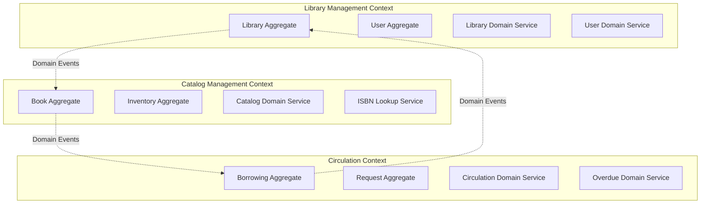
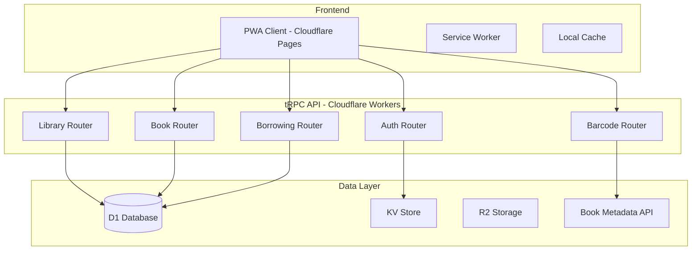

# Design Document

## Overview

The Company Bookshelf PWA is a multi-tenant SaaS application that enables organizations to manage their library book inventories. The system supports multiple libraries as separate tenants, each with isolated data and user management. The application is built as a Progressive Web App to provide native-like experience with offline capabilities.

The system addresses the core requirements of library management including book catalog management, borrowing workflows, barcode scanning integration, overdue management, book requests/donations, and comprehensive user access control across multiple library tenants.

### Key Design Principles

- **Multi-tenancy**: Complete data isolation between library tenants with tenant-per-library model
- **Progressive Web App**: Offline-first architecture with installable experience and background sync
- **Role-based Access Control**: Three distinct user roles (Super Admin, Library Admin, Library Reader) with granular permissions
- **Barcode Integration**: ISBN scanning for efficient book management with role-based scanning permissions
- **Email-based Authentication**: Passwordless login with verification codes and domain-based tenant association
- **Responsive Design**: Mobile-first approach optimized for various device types and scanning workflows
- **Scalable Architecture**: Cloudflare-based serverless architecture for global performance and cost efficiency

## Architecture

### Domain-Driven Design Architecture

The system is organized around three bounded contexts, each representing a core business domain with clear responsibilities and boundaries.

## Domain Language (Ubiquitous Language)

### Core Terms
- **Library**: An organization's book collection and management system
- **Book**: The conceptual item (title, author, ISBN)
- **Book Copy**: Physical instance of a book that can be borrowed
- **Member**: User with access to borrow books from their library
- **Librarian**: User who can manage the library's catalog and settings
- **Borrowing Record**: Active or historical record of a book being borrowed
- **Book Request**: Member request for library to acquire a new book
- **Donation**: Offer from member to contribute books to library

### Status Terms
- **Available**: Book copy ready for borrowing
- **Borrowed**: Book copy currently checked out
- **Overdue**: Borrowed book past its due date
- **Reserved**: Book copy held for specific member
- **Maintenance**: Book copy temporarily unavailable

#### Bounded Contexts Overview



#### 1. Library Management Bounded Context

**Domain Responsibility**: Managing library tenants, users, authentication, and access control.

**Key Rules**: 
- Email domain determines library membership
- Only one library per email domain
- Role assignments are library-scoped

**Core Aggregates:**

```typescript
// Library Aggregate Root
export class Library {
  private constructor(
    private readonly id: LibraryId,
    private name: LibraryName,
    private emailDomains: EmailDomain[],
    private settings: LibrarySettings,
    private status: LibraryStatus
  ) {}

  static create(name: string, emailDomains: string[]): Library {
    const library = new Library(
      LibraryId.generate(),
      LibraryName.create(name),
      emailDomains.map(domain => EmailDomain.create(domain)),
      LibrarySettings.createDefault(),
      LibraryStatus.ACTIVE
    );
    
    // Domain Event: LibraryCreated
    DomainEvents.raise(new LibraryCreatedEvent(library.id, library.name));
    
    return library;
  }

  canUserJoin(email: Email): boolean {
    return this.emailDomains.some(domain => domain.matches(email));
  }

  updateSettings(newSettings: LibrarySettings): void {
    this.settings = newSettings;
    // Domain Event: LibrarySettingsUpdated
    DomainEvents.raise(new LibrarySettingsUpdatedEvent(this.id, newSettings));
  }

  getId(): LibraryId { return this.id; }
  getName(): LibraryName { return this.name; }
  getSettings(): LibrarySettings { return this.settings; }
}

// User Aggregate Root
export class User {
  private constructor(
    private readonly id: UserId,
    private readonly email: Email,
    private name: UserName,
    private readonly libraryMembership: LibraryMembership,
    private status: UserStatus
  ) {}

  static create(email: string, name: string, libraryId: LibraryId, role: Role): User {
    const user = new User(
      UserId.generate(),
      Email.create(email),
      UserName.create(name),
      LibraryMembership.create(libraryId, role),
      UserStatus.ACTIVE
    );
    
    // Domain Event: UserRegistered
    DomainEvents.raise(new UserRegisteredEvent(user.id, user.email, libraryId));
    
    return user;
  }

  hasPermission(permission: Permission): boolean {
    return this.libraryMembership.role.hasPermission(permission);
  }

  canBorrowBooks(): boolean {
    return this.status === UserStatus.ACTIVE && 
           this.hasPermission(Permission.BORROW_BOOKS);
  }

  getId(): UserId { return this.id; }
  getLibraryId(): LibraryId { return this.libraryMembership.libraryId; }
  getRole(): Role { return this.libraryMembership.role; }
}
```

**Domain Services:**

```typescript
// Library Domain Service
export class LibraryDomainService {
  constructor(
    private libraryRepository: LibraryRepository,
    private userRepository: UserRepository
  ) {}

  async registerNewLibrary(name: string, emailDomains: string[], adminEmail: string): Promise<Library> {
    // Business rule: Library name must be unique
    const existingLibrary = await this.libraryRepository.findByName(name);
    if (existingLibrary) {
      throw new DomainError('Library name already exists');
    }

    // Create library
    const library = Library.create(name, emailDomains);
    await this.libraryRepository.save(library);

    // Create admin user
    const adminUser = User.create(adminEmail, 'Admin', library.getId(), Role.LIBRARY_ADMIN);
    await this.userRepository.save(adminUser);

    return library;
  }
}
```

#### 2. Catalog Management Bounded Context

**Domain Responsibility**: Managing book catalog, inventory, metadata, and discovery.

**Key Rules**:
- Books have metadata (title, author, ISBN) and physical copies
- Each copy has unique tracking (condition, location)
- ISBN validation and external metadata enrichment

**Core Aggregates:**

```typescript
// Book Aggregate Root
export class Book {
  private constructor(
    private readonly id: BookId,
    private readonly isbn: ISBN,
    private metadata: BookMetadata,
    private readonly libraryId: LibraryId,
    private inventory: BookInventory
  ) {}

  static create(isbn: string, metadata: BookMetadata, libraryId: LibraryId, quantity: number = 1): Book {
    const book = new Book(
      BookId.generate(),
      ISBN.create(isbn),
      metadata,
      libraryId,
      BookInventory.create(quantity)
    );
    
    // Domain Event: BookAdded
    DomainEvents.raise(new BookAddedEvent(book.id, book.isbn, libraryId, quantity));
    
    return book;
  }

  addCopies(quantity: number): void {
    if (quantity <= 0) {
      throw new DomainError('Quantity must be positive');
    }
    
    this.inventory = this.inventory.addCopies(quantity);
    // Domain Event: BookCopiesAdded
    DomainEvents.raise(new BookCopiesAddedEvent(this.id, quantity));
  }

  reserveCopy(): BookCopyId {
    if (!this.inventory.hasAvailableCopies()) {
      throw new DomainError('No copies available for borrowing');
    }
    
    const copyId = this.inventory.reserveNextAvailableCopy();
    // Domain Event: BookCopyReserved
    DomainEvents.raise(new BookCopyReservedEvent(this.id, copyId));
    
    return copyId;
  }

  returnCopy(copyId: BookCopyId): void {
    this.inventory.returnCopy(copyId);
    // Domain Event: BookCopyReturned
    DomainEvents.raise(new BookCopyReturnedEvent(this.id, copyId));
  }

  isAvailableForBorrowing(): boolean {
    return this.inventory.hasAvailableCopies();
  }

  getId(): BookId { return this.id; }
  getISBN(): ISBN { return this.isbn; }
  getLibraryId(): LibraryId { return this.libraryId; }
  getAvailableQuantity(): number { return this.inventory.getAvailableQuantity(); }
}

// Book Inventory Value Object
export class BookInventory {
  private constructor(private readonly copies: Map<BookCopyId, BookCopyStatus>) {}

  static create(quantity: number): BookInventory {
    const copies = new Map<BookCopyId, BookCopyStatus>();
    for (let i = 0; i < quantity; i++) {
      copies.set(BookCopyId.generate(), BookCopyStatus.AVAILABLE);
    }
    return new BookInventory(copies);
  }

  hasAvailableCopies(): boolean {
    return Array.from(this.copies.values()).some(status => status === BookCopyStatus.AVAILABLE);
  }

  reserveNextAvailableCopy(): BookCopyId {
    for (const [copyId, status] of this.copies.entries()) {
      if (status === BookCopyStatus.AVAILABLE) {
        this.copies.set(copyId, BookCopyStatus.RESERVED);
        return copyId;
      }
    }
    throw new DomainError('No available copies to reserve');
  }

  getAvailableQuantity(): number {
    return Array.from(this.copies.values())
      .filter(status => status === BookCopyStatus.AVAILABLE).length;
  }
}
```

#### 3. Circulation Bounded Context

**Domain Responsibility**: Managing borrowing, returning, overdue tracking, and book requests.

**Key Rules**:
- One active borrowing per book copy
- Due dates calculated from library policies
- Automated overdue notifications

**Core Aggregates:**

```typescript
// Borrowing Aggregate Root
export class BorrowTransaction {
  private constructor(
    private readonly id: BorrowTransactionId,
    private readonly bookId: BookId,
    private readonly userId: UserId,
    private readonly libraryId: LibraryId,
    private readonly borrowedAt: Date,
    private readonly dueDate: Date,
    private returnedAt: Date | null,
    private overdueNotificationsSent: number
  ) {}

  static create(bookId: BookId, userId: UserId, libraryId: LibraryId, borrowingPeriodDays: number): BorrowTransaction {
    const now = new Date();
    const dueDate = new Date(now.getTime() + borrowingPeriodDays * 24 * 60 * 60 * 1000);
    
    const transaction = new BorrowTransaction(
      BorrowTransactionId.generate(),
      bookId,
      userId,
      libraryId,
      now,
      dueDate,
      null,
      0
    );
    
    // Domain Event: BookBorrowed
    DomainEvents.raise(new BookBorrowedEvent(transaction.id, bookId, userId, dueDate));
    
    return transaction;
  }

  returnBook(): void {
    if (this.returnedAt) {
      throw new DomainError('Book already returned');
    }
    
    this.returnedAt = new Date();
    // Domain Event: BookReturned
    DomainEvents.raise(new BookReturnedEvent(this.id, this.bookId, this.userId));
  }

  isOverdue(): boolean {
    return !this.returnedAt && new Date() > this.dueDate;
  }

  markOverdueNotificationSent(): void {
    this.overdueNotificationsSent++;
    // Domain Event: OverdueNotificationSent
    DomainEvents.raise(new OverdueNotificationSentEvent(this.id, this.overdueNotificationsSent));
  }

  getId(): BorrowTransactionId { return this.id; }
  getBookId(): BookId { return this.bookId; }
  getUserId(): UserId { return this.userId; }
  getDueDate(): Date { return this.dueDate; }
  isReturned(): boolean { return this.returnedAt !== null; }
}
```

**Domain Services:**

```typescript
// Circulation Domain Service
export class CirculationDomainService {
  constructor(
    private bookRepository: BookRepository,
    private userRepository: UserRepository,
    private borrowTransactionRepository: BorrowTransactionRepository,
    private libraryRepository: LibraryRepository
  ) {}

  async borrowBook(bookId: BookId, userId: UserId): Promise<BorrowTransaction> {
    // Get entities
    const book = await this.bookRepository.findById(bookId);
    const user = await this.userRepository.findById(userId);
    const library = await this.libraryRepository.findById(user.getLibraryId());
    
    // Business rules validation
    if (!user.canBorrowBooks()) {
      throw new DomainError('User cannot borrow books');
    }
    
    if (!book.isAvailableForBorrowing()) {
      throw new DomainError('Book not available for borrowing');
    }
    
    // Check user's current borrowing limit
    const activeBorrows = await this.borrowTransactionRepository.findActiveByUser(userId);
    if (activeBorrows.length >= library.getSettings().maxBooksPerReader) {
      throw new DomainError('User has reached borrowing limit');
    }
    
    // Check for overdue books
    const overdueBooks = activeBorrows.filter(borrow => borrow.isOverdue());
    if (overdueBooks.length > 0) {
      throw new DomainError('User has overdue books');
    }
    
    // Execute borrowing
    const copyId = book.reserveCopy();
    const transaction = BorrowTransaction.create(
      bookId, 
      userId, 
      user.getLibraryId(), 
      library.getSettings().borrowingPeriodDays
    );
    
    // Save changes
    await this.bookRepository.save(book);
    await this.borrowTransactionRepository.save(transaction);
    
    return transaction;
  }
}
```

## Domain Events

### Event Types
```typescript
// Library Management Events
interface LibraryRegistered {
  libraryId: LibraryId;
  domain: EmailDomain;
  adminEmail: Email;
}

interface MemberAdded {
  libraryId: LibraryId;
  memberId: UserId;
  role: Role;
}

// Catalog Events
interface BookAdded {
  libraryId: LibraryId;
  bookId: BookId;
  isbn: ISBN;
}

interface CopyAdded {
  libraryId: LibraryId;
  bookId: BookId;
  copyId: CopyId;
}

// Circulation Events
interface BookBorrowed {
  libraryId: LibraryId;
  borrowingId: BorrowingId;
  copyId: CopyId;
  memberId: UserId;
  dueDate: Date;
}

interface BookReturned {
  libraryId: LibraryId;
  borrowingId: BorrowingId;
  copyId: CopyId;
  returnedAt: Date;
}

interface BookOverdue {
  libraryId: LibraryId;
  borrowingId: BorrowingId;
  memberId: UserId;
  daysOverdue: number;
}
```

## Repository Patterns

### Interface Segregation
```typescript
// Read-side repositories
interface BookCatalogQuery {
  findAvailableBooks(libraryId: LibraryId, search?: string): Promise<BookSummary[]>;
  getBookDetails(bookId: BookId): Promise<BookDetails>;
  getBorrowingHistory(copyId: CopyId): Promise<BorrowingHistory[]>;
}

// Write-side repositories
interface BookRepository {
  save(book: Book): Promise<void>;
  findById(id: BookId): Promise<Book | null>;
  findByISBN(isbn: ISBN, libraryId: LibraryId): Promise<Book | null>;
}

interface BorrowingRepository {
  save(record: BorrowingRecord): Promise<void>;
  findActiveByMember(memberId: UserId): Promise<BorrowingRecord[]>;
  findOverdueRecords(libraryId: LibraryId): Promise<BorrowingRecord[]>;
}
```

## Multi-Tenant Domain Rules

### Tenant Isolation
- All aggregates MUST include LibraryId as part of their identity
- Cross-tenant operations are explicitly forbidden at domain level
- Domain services validate tenant boundaries before operations

### Tenant-Specific Policies
```typescript
interface LibraryPolicy {
  maxBorrowingDays: number;
  maxBooksPerMember: number;
  allowExtensions: boolean;
  overdueNotificationDays: number[];
  requireApprovalForRequests: boolean;
}

class CirculationService {
  constructor(private policyRepository: LibraryPolicyRepository) {}

  async borrowBook(copyId: CopyId, memberId: UserId): Promise<BorrowingRecord> {
    const policy = await this.policyRepository.getByLibrary(libraryId);
    // Apply library-specific borrowing rules
  }
}
```

## Anti-Corruption Layer

### External Service Integration
```typescript
// Protect domain from external API changes
interface BookMetadataProvider {
  lookupByISBN(isbn: ISBN): Promise<ExternalBookData>;
}

class OpenLibraryAdapter implements BookMetadataProvider {
  async lookupByISBN(isbn: ISBN): Promise<ExternalBookData> {
    const response = await this.httpClient.get(`/isbn/${isbn}`);
    // Transform external format to domain format
    return this.transformToBookMetadata(response);
  }

  private transformToBookMetadata(external: any): ExternalBookData {
    // Isolate domain from external API structure
  }
}
```

## Domain Service Guidelines

### When to Use Domain Services
- Logic that doesn't naturally belong to a single aggregate
- Operations requiring multiple aggregates
- Complex business rules involving external systems
- Cross-context coordination (via events)

### Service Design
```typescript
class BookRequestService {
  constructor(
    private bookRepository: BookRepository,
    private requestRepository: BookRequestRepository,
    private eventBus: DomainEventBus
  ) {}

  async processRequest(requestId: RequestId): Promise<void> {
    const request = await this.requestRepository.findById(requestId);
    
    // Check if book already exists
    const existingBook = await this.bookRepository.findByISBN(
      request.isbn, 
      request.libraryId
    );

    if (existingBook) {
      request.markAsDuplicate();
    } else {
      request.approve();
      // Publish event for catalog team to add book
      await this.eventBus.publish(new BookRequestApproved({
        requestId: request.id,
        isbn: request.isbn,
        libraryId: request.libraryId
      }));
    }

    await this.requestRepository.save(request);
  }
}
```

## DDD Implementation Guidelines

### Aggregate Boundaries
- Keep aggregates small and focused
- Avoid deep object graphs within aggregates
- Use eventual consistency between aggregates
- Enforce invariants only within aggregate boundaries

### Domain Logic Location
- **Entities**: Identity and core business rules
- **Value Objects**: Immutable concepts and validation
- **Domain Services**: Multi-aggregate operations
- **Application Services**: Orchestration and infrastructure coordination

### Testing Strategy
- **Unit Tests**: Domain logic in isolation
- **Integration Tests**: Repository implementations
- **Domain Tests**: Business scenarios across aggregates
- **Contract Tests**: Anti-corruption layer boundaries

### High-Level Architecture (Cloudflare)



### Technology Stack (Cloudflare Optimized)

**Frontend:**
- SvelteKit with TypeScript (deployed to Cloudflare Pages)
- Built-in PWA capabilities (Service Worker, Web App Manifest)
- Tailwind CSS for styling (minimal bundle size)
- shadcn-svelte for UI components (copy-paste, tree-shakeable)
- tRPC-SvelteKit for type-safe API calls
- Camera API for barcode scanning

**Backend:**
- Cloudflare Workers with Hono.js framework
- TypeScript
- tRPC with @hono/trpc-server integration
- Lucia Auth for authentication and session management
- Drizzle ORM for type-safe database operations
- Multi-tenant database architecture
- Type-safe API procedures

**Database:**
- Cloudflare D1 (SQLite-based, free tier: 100k reads/day, 100k writes/day)
- Drizzle ORM for type-safe database operations
- Cloudflare KV for caching and session management (free tier: 100k reads/day, 1k writes/day)

**External Services:**
- Open Library API for book metadata (free)
- Cloudflare Email Workers for email notifications (free tier available)
- Cloudflare R2 for book cover image storage (free tier: 10GB storage)

### Hono.js + tRPC Backend Architecture

**Backend Structure with Hono.js:**

```typescript
// worker/src/index.ts - Main Hono app
import { Hono } from 'hono';
import { cors } from 'hono/cors';
import { jwt } from 'hono/jwt';
import { trpcServer } from '@hono/trpc-server';
import { appRouter } from './router';
import { createContext } from './context';

const app = new Hono<{ Bindings: CloudflareBindings }>();

// CORS middleware
app.use('*', cors({
  origin: ['https://your-app.pages.dev'],
  credentials: true
}));

// Tenant isolation middleware
app.use('/api/trpc/*', async (c, next) => {
  const token = c.req.header('Authorization')?.replace('Bearer ', '');
  if (token) {
    try {
      const payload = await jwt.verify(token, c.env.JWT_SECRET);
      c.set('user', payload);
    } catch (e) {
      // Handle invalid token
    }
  }
  await next();
});

// tRPC integration with Hono
app.use('/api/trpc/*', trpcServer({
  router: appRouter,
  createContext: (opts, c) => createContext(opts, c),
  onError: ({ error, path }) => {
    console.error(`tRPC Error on ${path}:`, error);
  }
}));

// Health check endpoint
app.get('/health', (c) => c.json({ status: 'ok' }));

export default app;
```

**tRPC Context with Hono:**

```typescript
// worker/src/context.ts
import type { Context } from 'hono';
import type { CloudflareBindings } from './types';

export async function createContext(
  opts: any,
  c: Context<{ Bindings: CloudflareBindings }>
) {
  const user = c.get('user');
  
  return {
    db: c.env.DB, // D1 Database
    kv: c.env.KV, // KV Store
    r2: c.env.R2, // R2 Storage
    user,
    libraryId: user?.libraryId,
    userRole: user?.role,
  };
}

export type Context = Awaited<ReturnType<typeof createContext>>;
```

**Domain-based tRPC Routers:**

```typescript
// worker/src/router/index.ts
import { router } from '../trpc';
import { authRouter } from './auth';
import { libraryRouter } from './library';
import { bookRouter } from './book';
import { borrowingRouter } from './borrowing';
import { barcodeRouter } from './barcode';

export const appRouter = router({
  auth: authRouter,
  library: libraryRouter,
  book: bookRouter,
  borrowing: borrowingRouter,
  barcode: barcodeRouter,
});

export type AppRouter = typeof appRouter;
```

**Example Book Router with Hono Context:**

```typescript
// worker/src/router/book.ts
import { z } from 'zod';
import { router, protectedProcedure, adminProcedure } from '../trpc';
import { BookService } from '../services/BookService';

export const bookRouter = router({
  list: protectedProcedure
    .input(z.object({
      search: z.string().optional(),
      page: z.number().default(1),
      limit: z.number().max(50).default(20)
    }))
    .query(async ({ input, ctx }) => {
      const bookService = new BookService(ctx.db);
      return await bookService.findByLibrary(
        ctx.libraryId!,
        input
      );
    }),

  add: adminProcedure
    .input(z.object({
      isbn: z.string(),
      title: z.string(),
      author: z.string(),
      quantity: z.number().default(1)
    }))
    .mutation(async ({ input, ctx }) => {
      const bookService = new BookService(ctx.db);
      return await bookService.create({
        ...input,
        libraryId: ctx.libraryId!
      });
    }),

  borrow: protectedProcedure
    .input(z.object({ bookId: z.string().uuid() }))
    .mutation(async ({ input, ctx }) => {
      const bookService = new BookService(ctx.db);
      return await bookService.borrowBook(
        input.bookId,
        ctx.user!.id,
        ctx.libraryId!
      );
    }),
});
```

### SvelteKit + tRPC Integration

**Frontend Architecture:**

```typescript
// src/lib/trpc.ts - tRPC client setup
import { createTRPCClient, type TRPCClientInit } from 'trpc-sveltekit';
import type { AppRouter } from '../../../worker/src/router';

export const trpc = createTRPCClient<AppRouter>({
  url: '/api/trpc',
  transformer: superjson,
  headers: () => {
    const token = localStorage.getItem('auth-token');
    return token ? { Authorization: `Bearer ${token}` } : {};
  }
});

// src/routes/+layout.ts - Global data loading
export const load = async ({ fetch }) => {
  try {
    const user = await trpc.auth.me.query();
    return { user };
  } catch (error) {
    return { user: null };
  }
};
```

**SvelteKit Routes Structure:**
```
src/routes/
├── +layout.svelte          # Global layout with PWA shell
├── +layout.ts              # Global data loading
├── (auth)/
│   ├── login/+page.svelte  # Login page
│   └── verify/+page.svelte # Verification page
├── (app)/
│   ├── +layout.svelte      # Authenticated layout
│   ├── books/
│   │   ├── +page.svelte    # Book catalog
│   │   ├── +page.ts        # Load books data
│   │   └── [id]/+page.svelte # Book details
│   ├── borrow/+page.svelte # Borrowing interface
│   ├── scan/+page.svelte   # Barcode scanner
│   └── admin/
│       └── +page.svelte    # Admin dashboard
└── api/
    └── trpc/[...trpc]/+server.ts # tRPC handler
```

**tRPC API Design:**

```typescript
// Main tRPC Router
export const appRouter = router({
  auth: authRouter,
  library: libraryRouter,
  book: bookRouter,
  borrowing: borrowingRouter,
  request: requestRouter,
  barcode: barcodeRouter,
});

// SvelteKit Usage Examples
// src/routes/(app)/books/+page.ts
export const load = async ({ parent }) => {
  const { user } = await parent();
  const books = await trpc.book.list.query({
    libraryId: user.libraryId,
    page: 1,
    limit: 20
  });
  return { books };
};

// src/routes/(app)/scan/+page.svelte
<script lang="ts">
  import { trpc } from '$lib/trpc';
  import { page } from '$app/stores';
  
  async function handleBarcodeScan(isbn: string) {
    const result = await trpc.barcode.scan.mutate({
      isbn,
      action: 'borrow'
    });
    // Handle result with reactive updates
  }
</script>
```

**UI Components with shadcn-svelte:**

```typescript
// src/lib/components/ui/book-card.svelte
<script lang="ts">
  import { Card, CardContent, CardHeader, CardTitle } from '$lib/components/ui/card';
  import { Button } from '$lib/components/ui/button';
  import { Badge } from '$lib/components/ui/badge';
  import type { Book } from '$lib/types';

  export let book: Book;
  export let onBorrow: (bookId: string) => void;
</script>

<Card class="w-full max-w-sm">
  <CardHeader>
    <CardTitle class="text-lg">{book.title}</CardTitle>
    <p class="text-sm text-muted-foreground">by {book.author}</p>
  </CardHeader>
  <CardContent>
    <div class="flex justify-between items-center">
      <Badge variant={book.availableQuantity > 0 ? 'default' : 'secondary'}>
        {book.availableQuantity > 0 ? 'Available' : 'Borrowed'}
      </Badge>
      <Button 
        size="sm" 
        disabled={book.availableQuantity === 0}
        on:click={() => onBorrow(book.id)}
      >
        Borrow
      </Button>
    </div>
  </CardContent>
</Card>
```

**Barcode Scanner Component:**

```svelte
<!-- src/lib/components/barcode-scanner.svelte -->
<script lang="ts">
  import { Button } from '$lib/components/ui/button';
  import { Card, CardContent } from '$lib/components/ui/card';
  import { onMount } from 'svelte';

  export let onScan: (isbn: string) => void;
  
  let videoElement: HTMLVideoElement;
  let scanning = false;

  async function startScanning() {
    scanning = true;
    const stream = await navigator.mediaDevices.getUserMedia({ 
      video: { facingMode: 'environment' } 
    });
    videoElement.srcObject = stream;
    // Implement barcode detection logic
  }

  function stopScanning() {
    scanning = false;
    const stream = videoElement.srcObject as MediaStream;
    stream?.getTracks().forEach(track => track.stop());
  }
</script>

<Card class="w-full max-w-md mx-auto">
  <CardContent class="p-6">
    <div class="space-y-4">
      <video bind:this={videoElement} class="w-full rounded-lg" autoplay muted></video>
      <div class="flex gap-2">
        <Button on:click={startScanning} disabled={scanning} class="flex-1">
          Start Scanning
        </Button>
        <Button variant="outline" on:click={stopScanning} disabled={!scanning} class="flex-1">
          Stop
        </Button>
      </div>
    </div>
  </CardContent>
</Card>
```

**PWA Configuration:**
```typescript
// vite.config.js
import { sveltekit } from '@sveltejs/kit/vite';
import { SvelteKitPWA } from '@vite-pwa/sveltekit';

export default {
  plugins: [
    sveltekit(),
    SvelteKitPWA({
      strategies: 'injectManifest',
      srcDir: 'src',
      filename: 'sw.ts',
      workbox: {
        globPatterns: ['**/*.{js,css,html,ico,png,svg,webp,woff,woff2}']
      },
      manifest: {
        name: 'Library Manager',
        short_name: 'LibraryPWA',
        theme_color: '#1e40af',
        background_color: '#ffffff',
        display: 'standalone',
        scope: '/',
        start_url: '/',
        icons: [
          {
            src: '/icon-192.png',
            sizes: '192x192',
            type: 'image/png'
          },
          {
            src: '/icon-512.png',
            sizes: '512x512',
            type: 'image/png'
          }
        ]
      }
    })
  ]
};
```

**Component Library Setup:**
```bash
# Initialize shadcn-svelte
npx shadcn-svelte@latest init

# Add essential components for library management
npx shadcn-svelte@latest add button card input table badge dialog sheet tabs
```

### Drizzle ORM Schema

**Database Schema with Drizzle:**

```typescript
// worker/src/db/schema.ts
import { sqliteTable, text, integer, real } from 'drizzle-orm/sqlite-core';
import { relations } from 'drizzle-orm';

export const libraries = sqliteTable('libraries', {
  id: text('id').primaryKey(),
  name: text('name').notNull(),
  emailDomains: text('email_domains', { mode: 'json' }).$type<string[]>().notNull(),
  settings: text('settings', { mode: 'json' }).$type<LibrarySettings>().notNull(),
  isActive: integer('is_active', { mode: 'boolean' }).default(true),
  createdAt: text('created_at').default('CURRENT_TIMESTAMP'),
  updatedAt: text('updated_at').default('CURRENT_TIMESTAMP'),
});

export const users = sqliteTable('users', {
  id: text('id').primaryKey(),
  email: text('email').notNull(),
  name: text('name').notNull(),
  libraryId: text('library_id').references(() => libraries.id).notNull(),
  role: text('role', { enum: ['super_admin', 'library_admin', 'library_reader'] }).notNull(),
  isActive: integer('is_active', { mode: 'boolean' }).default(true),
  createdAt: text('created_at').default('CURRENT_TIMESTAMP'),
  lastLoginAt: text('last_login_at'),
});

export const books = sqliteTable('books', {
  id: text('id').primaryKey(),
  isbn: text('isbn').notNull(),
  title: text('title').notNull(),
  author: text('author').notNull(),
  publisher: text('publisher'),
  publishedYear: integer('published_year'),
  genre: text('genre'),
  description: text('description'),
  coverImageUrl: text('cover_image_url'),
  libraryId: text('library_id').references(() => libraries.id).notNull(),
  quantity: integer('quantity').default(1),
  availableQuantity: integer('available_quantity').default(1),
  createdAt: text('created_at').default('CURRENT_TIMESTAMP'),
  updatedAt: text('updated_at').default('CURRENT_TIMESTAMP'),
});

export const borrowTransactions = sqliteTable('borrow_transactions', {
  id: text('id').primaryKey(),
  bookId: text('book_id').references(() => books.id).notNull(),
  userId: text('user_id').references(() => users.id).notNull(),
  libraryId: text('library_id').references(() => libraries.id).notNull(),
  borrowedAt: text('borrowed_at').notNull(),
  dueDate: text('due_date').notNull(),
  returnedAt: text('returned_at'),
  isOverdue: integer('is_overdue', { mode: 'boolean' }).default(false),
});

export const bookRequests = sqliteTable('book_requests', {
  id: text('id').primaryKey(),
  userId: text('user_id').references(() => users.id).notNull(),
  libraryId: text('library_id').references(() => libraries.id).notNull(),
  title: text('title').notNull(),
  author: text('author'),
  isbn: text('isbn'),
  status: text('status', { enum: ['pending', 'approved', 'rejected'] }).default('pending'),
  createdAt: text('created_at').default('CURRENT_TIMESTAMP'),
});

// Relations
export const librariesRelations = relations(libraries, ({ many }) => ({
  users: many(users),
  books: many(books),
}));

export const usersRelations = relations(users, ({ one, many }) => ({
  library: one(libraries, { fields: [users.libraryId], references: [libraries.id] }),
  borrowTransactions: many(borrowTransactions),
}));

export const booksRelations = relations(books, ({ one, many }) => ({
  library: one(libraries, { fields: [books.libraryId], references: [libraries.id] }),
  borrowTransactions: many(borrowTransactions),
}));
```

### Authentication with Lucia Auth

**Lucia Auth Setup:**

```typescript
// worker/src/auth/lucia.ts
import { Lucia } from 'lucia';
import { D1Adapter } from '@lucia-auth/adapter-sqlite';
import type { DatabaseUser } from '../db/schema';

export function initializeLucia(db: D1Database) {
  const adapter = new D1Adapter(db, {
    user: 'users',
    session: 'sessions'
  });

  return new Lucia(adapter, {
    sessionCookie: {
      attributes: {
        secure: true,
        sameSite: 'strict'
      }
    },
    getUserAttributes: (attributes) => {
      return {
        email: attributes.email,
        name: attributes.name,
        libraryId: attributes.library_id,
        role: attributes.role
      };
    }
  });
}

export type Auth = ReturnType<typeof initializeLucia>;

declare module 'lucia' {
  interface Register {
    Lucia: Auth;
    DatabaseUserAttributes: {
      email: string;
      name: string;
      library_id: string;
      role: 'super_admin' | 'library_admin' | 'library_reader';
    };
  }
}
```

**Updated Drizzle Schema for Lucia:**

```typescript
// worker/src/db/schema.ts - Add session table for Lucia
export const sessions = sqliteTable('sessions', {
  id: text('id').primaryKey(),
  userId: text('user_id').references(() => users.id).notNull(),
  expiresAt: integer('expires_at').notNull(),
});

// Update users table to match Lucia requirements
export const users = sqliteTable('users', {
  id: text('id').primaryKey(),
  email: text('email').notNull().unique(),
  name: text('name').notNull(),
  libraryId: text('library_id').references(() => libraries.id).notNull(),
  role: text('role', { enum: ['super_admin', 'library_admin', 'library_reader'] }).notNull(),
  isActive: integer('is_active', { mode: 'boolean' }).default(true),
  createdAt: text('created_at').default('CURRENT_TIMESTAMP'),
  lastLoginAt: text('last_login_at'),
});
```

**Authentication Router with Lucia:**

```typescript
// worker/src/router/auth.ts
import { z } from 'zod';
import { TRPCError } from '@trpc/server';
import { router, publicProcedure, protectedProcedure } from '../trpc';
import { UserService } from '../services/UserService';
import { generateId } from 'lucia';

export const authRouter = router({
  login: publicProcedure
    .input(z.object({ email: z.string().email() }))
    .mutation(async ({ input, ctx }) => {
      // Generate 6-digit verification code
      const code = Math.random().toString().slice(2, 8);
      
      // Store code in KV with 5-minute expiration
      await ctx.kv.put(`auth:${input.email}`, code, { expirationTtl: 300 });
      
      // Send verification email (implement email service)
      // await sendVerificationEmail(input.email, code);
      
      return { success: true, message: 'Verification code sent' };
    }),

  verify: publicProcedure
    .input(z.object({ 
      email: z.string().email(), 
      code: z.string().length(6) 
    }))
    .mutation(async ({ input, ctx }) => {
      // Verify code from KV
      const storedCode = await ctx.kv.get(`auth:${input.email}`);
      
      if (!storedCode || storedCode !== input.code) {
        throw new TRPCError({ 
          code: 'UNAUTHORIZED', 
          message: 'Invalid or expired verification code' 
        });
      }
      
      // Find or create user
      const userService = new UserService(ctx.db);
      const user = await userService.findOrCreateByEmail(input.email);
      
      if (!user) {
        throw new TRPCError({ 
          code: 'NOT_FOUND', 
          message: 'User not found or email domain not allowed' 
        });
      }
      
      // Create Lucia session
      const session = await ctx.lucia.createSession(user.id, {});
      const sessionCookie = ctx.lucia.createSessionCookie(session.id);
      
      // Clean up verification code
      await ctx.kv.delete(`auth:${input.email}`);
      
      return { 
        success: true,
        sessionCookie: sessionCookie.serialize(),
        user: {
          id: user.id,
          email: user.email,
          name: user.name,
          libraryId: user.libraryId,
          role: user.role
        }
      };
    }),

  me: protectedProcedure
    .query(async ({ ctx }) => {
      if (!ctx.user) {
        throw new TRPCError({ code: 'UNAUTHORIZED' });
      }
      
      return {
        id: ctx.user.id,
        email: ctx.user.email,
        name: ctx.user.name,
        libraryId: ctx.user.libraryId,
        role: ctx.user.role
      };
    }),

  logout: protectedProcedure
    .mutation(async ({ ctx }) => {
      if (!ctx.session) {
        throw new TRPCError({ code: 'UNAUTHORIZED' });
      }
      
      await ctx.lucia.invalidateSession(ctx.session.id);
      const sessionCookie = ctx.lucia.createBlankSessionCookie();
      
      return { 
        success: true,
        sessionCookie: sessionCookie.serialize()
      };
    }),
});
```

**Updated tRPC Context with Lucia:**

```typescript
// worker/src/context.ts
import type { Context } from 'hono';
import type { CloudflareBindings } from './types';
import { initializeLucia } from './auth/lucia';

export async function createContext(
  opts: any,
  c: Context<{ Bindings: CloudflareBindings }>
) {
  const lucia = initializeLucia(c.env.DB);
  
  // Get session from cookie
  const sessionId = lucia.readSessionCookie(c.req.header('Cookie') ?? '');
  let user = null;
  let session = null;
  
  if (sessionId) {
    const result = await lucia.validateSession(sessionId);
    user = result.user;
    session = result.session;
  }
  
  return {
    db: c.env.DB,
    kv: c.env.KV,
    r2: c.env.R2,
    lucia,
    user,
    session,
    libraryId: user?.libraryId,
    userRole: user?.role,
  };
}

export type Context = Awaited<ReturnType<typeof createContext>>;
```

**Hono.js Services Layer with Drizzle:**

```typescript
// worker/src/services/BookService.ts
import { drizzle } from 'drizzle-orm/d1';
import { eq, and, like, desc } from 'drizzle-orm';
import { books, borrowTransactions } from '../db/schema';

export class BookService {
  private db;
  
  constructor(d1: D1Database) {
    this.db = drizzle(d1);
  }

  async findByLibrary(libraryId: string, filters: BookFilters) {
    let query = this.db
      .select()
      .from(books)
      .where(eq(books.libraryId, libraryId));

    if (filters.search) {
      query = query.where(
        and(
          eq(books.libraryId, libraryId),
          like(books.title, `%${filters.search}%`)
        )
      );
    }

    return await query
      .limit(filters.limit)
      .offset((filters.page - 1) * filters.limit);
  }

  async borrowBook(bookId: string, userId: string, libraryId: string) {
    // Check availability
    const book = await this.db
      .select()
      .from(books)
      .where(
        and(
          eq(books.id, bookId),
          eq(books.libraryId, libraryId)
        )
      )
      .get();

    if (!book || book.availableQuantity <= 0) {
      throw new Error('Book not available');
    }

    // Create transaction in batch
    const dueDate = new Date();
    dueDate.setDate(dueDate.getDate() + 14);

    await this.db.batch([
      // Update book availability
      this.db
        .update(books)
        .set({ availableQuantity: book.availableQuantity - 1 })
        .where(eq(books.id, bookId)),
      
      // Create borrow transaction
      this.db
        .insert(borrowTransactions)
        .values({
          id: crypto.randomUUID(),
          bookId,
          userId,
          libraryId,
          borrowedAt: new Date().toISOString(),
          dueDate: dueDate.toISOString(),
        })
    ]);

    return { success: true, dueDate };
  }

  async returnBook(bookId: string, userId: string, libraryId: string) {
    // Find active borrow transaction
    const transaction = await this.db
      .select()
      .from(borrowTransactions)
      .where(
        and(
          eq(borrowTransactions.bookId, bookId),
          eq(borrowTransactions.userId, userId),
          eq(borrowTransactions.libraryId, libraryId),
          eq(borrowTransactions.returnedAt, null)
        )
      )
      .get();

    if (!transaction) {
      throw new Error('No active borrow transaction found');
    }

    // Return book in batch
    await this.db.batch([
      // Update transaction
      this.db
        .update(borrowTransactions)
        .set({ returnedAt: new Date().toISOString() })
        .where(eq(borrowTransactions.id, transaction.id)),
      
      // Update book availability
      this.db
        .update(books)
        .set({ availableQuantity: books.availableQuantity + 1 })
        .where(eq(books.id, bookId))
    ]);

    return { success: true };
  }
}
```

**Multi-tenant Middleware:**

```typescript
// worker/src/middleware/tenant.ts
import type { Context, Next } from 'hono';

export async function tenantMiddleware(c: Context, next: Next) {
  const user = c.get('user');
  
  if (!user?.libraryId) {
    return c.json({ error: 'No library access' }, 403);
  }
  
  // Ensure all DB operations are scoped to user's library
  c.set('libraryId', user.libraryId);
  
  await next();
}
```

**Benefits for our PWA:**
- **Type Safety**: Shared types between client and server
- **Excellent DX**: Auto-completion and compile-time error checking
- **SvelteKit Integration**: Built-in stores, reactive updates, optimistic UI
- **Smallest Bundle**: Compiles away framework overhead, tree-shakeable
- **PWA-First**: SvelteKit has built-in PWA support with service workers
- **Performance**: Fastest runtime performance, perfect for mobile devices
- **Edge Optimized**: Hono.js built specifically for Cloudflare Workers
- **Multi-tenant Security**: Built-in tenant isolation at middleware level

## Core Domain Models

### 1. Library Domain

**Simple entities for multi-tenant library management:**

```typescript
interface Library {
  id: string;
  name: string;
  emailDomains: string[];
  settings: {
    borrowingPeriodDays: number;
    maxBooksPerReader: number;
    allowRequests: boolean;
    allowDonations: boolean;
  };
  isActive: boolean;
}

interface User {
  id: string;
  email: string;
  name: string;
  libraryId: string;
  role: 'super_admin' | 'library_admin' | 'library_reader';
  isActive: boolean;
}
```

### 2. Book Domain

**Core book and inventory management:**

```typescript
interface Book {
  id: string;
  isbn: string;
  title: string;
  author: string;
  publisher?: string;
  publishedYear?: number;
  genre?: string;
  description?: string;
  coverImageUrl?: string;
  libraryId: string;
  quantity: number;
  availableQuantity: number;
}

interface BookMetadata {
  isbn: string;
  title: string;
  authors: string[];
  publisher: string;
  publishedDate: string;
  description: string;
  imageLinks: {
    thumbnail?: string;
    small?: string;
    medium?: string;
  };
}
```

### 3. Borrowing Domain

**Simple borrowing and transaction management:**

```typescript
interface BorrowTransaction {
  id: string;
  bookId: string;
  userId: string;
  libraryId: string;
  borrowedAt: Date;
  dueDate: Date;
  returnedAt?: Date;
  isOverdue: boolean;
}

interface BookRequest {
  id: string;
  userId: string;
  libraryId: string;
  title: string;
  author?: string;
  isbn?: string;
  status: 'pending' | 'approved' | 'rejected';
  createdAt: Date;
}

interface BookDonation {
  id: string;
  userId: string;
  libraryId: string;
  title: string;
  author: string;
  isbn?: string;
  status: 'offered' | 'approved' | 'rejected';
  createdAt: Date;
}
```

#### 4. Borrowing Management Component
**Purpose**: Manages book borrowing and returning workflows

**Key Features:**
- Borrow/return transactions
- Due date management
- Overdue tracking
- Borrowing history

**Interfaces:**
```typescript
interface BorrowTransaction {
  id: string;
  bookInstanceId: string;
  userId: string;
  tenantId: string;
  borrowedAt: Date;
  dueDate: Date;
  returnedAt?: Date;
  isOverdue: boolean;
  overdueNotificationsSent: number;
}

interface BorrowingRules {
  maxBooksPerUser: number;
  borrowingPeriodDays: number;
  renewalAllowed: boolean;
  maxRenewals: number;
}
```

#### 5. Barcode Scanning Component
**Purpose**: Handles ISBN barcode scanning and book identification

**Key Features:**
- Camera-based barcode scanning
- ISBN validation and lookup
- Integration with external book APIs
- Offline barcode queue

**Interfaces:**
```typescript
interface BarcodeScanner {
  startScanning(): Promise<void>;
  stopScanning(): void;
  onBarcodeDetected: (isbn: string) => void;
}

interface BookLookupService {
  lookupByISBN(isbn: string): Promise<BookMetadata>;
  validateISBN(isbn: string): boolean;
}

interface BookMetadata {
  isbn: string;
  title: string;
  authors: string[];
  publisher: string;
  publishedDate: string;
  description: string;
  imageLinks: {
    thumbnail?: string;
    small?: string;
    medium?: string;
  };
}
```

#### 6. Request and Donation Component
**Purpose**: Manages book requests and donation workflows

**Key Features:**
- Book request submission and tracking
- Donation offer management
- Admin approval workflows
- Notification system

**Interfaces:**
```typescript
interface BookRequest {
  id: string;
  userId: string;
  tenantId: string;
  title: string;
  author?: string;
  isbn?: string;
  reason?: string;
  status: RequestStatus;
  requestCount: number;
  createdAt: Date;
  approvedAt?: Date;
  approvedBy?: string;
}

interface BookDonation {
  id: string;
  userId: string;
  tenantId: string;
  title: string;
  author: string;
  isbn?: string;
  condition: string;
  status: DonationStatus;
  createdAt: Date;
  approvedAt?: Date;
  approvedBy?: string;
}

enum RequestStatus {
  PENDING = 'pending',
  APPROVED = 'approved',
  REJECTED = 'rejected',
  FULFILLED = 'fulfilled'
}

enum DonationStatus {
  OFFERED = 'offered',
  APPROVED = 'approved',
  REJECTED = 'rejected',
  RECEIVED = 'received'
}
```

#### 7. Notification Component
**Purpose**: Handles email notifications and communication

**Key Features:**
- Overdue book reminders
- Request/donation status updates
- Welcome emails
- Admin notifications

**Interfaces:**
```typescript
interface NotificationService {
  sendOverdueReminder(transaction: BorrowTransaction): Promise<void>;
  sendWelcomeEmail(user: User): Promise<void>;
  sendRequestNotification(request: BookRequest): Promise<void>;
  sendDonationNotification(donation: BookDonation): Promise<void>;
}

interface EmailTemplate {
  id: string;
  name: string;
  subject: string;
  htmlContent: string;
  textContent: string;
  variables: string[];
}
```

## Data Models

### Database Schema Design

The system uses a multi-tenant database architecture with tenant isolation at the application level.

#### Core Tables

**tenants**
```sql
CREATE TABLE tenants (
  id UUID PRIMARY KEY DEFAULT gen_random_uuid(),
  name VARCHAR(255) NOT NULL,
  email_domains TEXT[] NOT NULL,
  settings JSONB DEFAULT '{}',
  is_active BOOLEAN DEFAULT true,
  created_at TIMESTAMP DEFAULT NOW(),
  updated_at TIMESTAMP DEFAULT NOW()
);
```

**users**
```sql
CREATE TABLE users (
  id UUID PRIMARY KEY DEFAULT gen_random_uuid(),
  email VARCHAR(255) NOT NULL,
  name VARCHAR(255) NOT NULL,
  tenant_id UUID NOT NULL REFERENCES tenants(id),
  role VARCHAR(50) NOT NULL,
  is_active BOOLEAN DEFAULT true,
  created_at TIMESTAMP DEFAULT NOW(),
  last_login_at TIMESTAMP,
  UNIQUE(email, tenant_id)
);
```

**books**
```sql
CREATE TABLE books (
  id UUID PRIMARY KEY DEFAULT gen_random_uuid(),
  isbn VARCHAR(20) NOT NULL,
  title VARCHAR(500) NOT NULL,
  author VARCHAR(500) NOT NULL,
  publisher VARCHAR(255),
  published_year INTEGER,
  genre VARCHAR(100),
  description TEXT,
  cover_image_url TEXT,
  tenant_id UUID NOT NULL REFERENCES tenants(id),
  quantity INTEGER DEFAULT 1,
  available_quantity INTEGER DEFAULT 1,
  created_at TIMESTAMP DEFAULT NOW(),
  updated_at TIMESTAMP DEFAULT NOW(),
  INDEX(tenant_id, isbn),
  INDEX(tenant_id, title),
  INDEX(tenant_id, author)
);
```

**book_instances**
```sql
CREATE TABLE book_instances (
  id UUID PRIMARY KEY DEFAULT gen_random_uuid(),
  book_id UUID NOT NULL REFERENCES books(id),
  status VARCHAR(50) DEFAULT 'available',
  borrowed_by UUID REFERENCES users(id),
  borrowed_at TIMESTAMP,
  due_date TIMESTAMP,
  returned_at TIMESTAMP,
  created_at TIMESTAMP DEFAULT NOW(),
  INDEX(book_id),
  INDEX(borrowed_by),
  INDEX(status)
);
```

### Multi-Tenant Data Isolation

**Row-Level Security (RLS):**
- All queries automatically filtered by tenant_id
- Application-level tenant context enforcement
- Database policies to prevent cross-tenant data access

**Tenant Context Middleware:**
```typescript
interface TenantContext {
  tenantId: string;
  userId: string;
  userRole: UserRole;
}

// All database operations include tenant context
class BookRepository {
  async findByTenant(tenantId: string, filters: BookFilters): Promise<Book[]> {
    return this.db.books.findMany({
      where: {
        tenantId,
        ...filters
      }
    });
  }
}
```

## Error Handling

### Error Categories

1. **Authentication Errors**
   - Invalid verification codes
   - Expired tokens
   - Unauthorized access attempts

2. **Authorization Errors**
   - Insufficient permissions
   - Cross-tenant access attempts
   - Role-based access violations

3. **Business Logic Errors**
   - Book already borrowed
   - Overdue books preventing new borrowing
   - Invalid ISBN formats

4. **External Service Errors**
   - Book API lookup failures
   - Email service failures
   - Barcode scanning errors

### Error Response Format

```typescript
interface ApiError {
  code: string;
  message: string;
  details?: any;
  timestamp: string;
  requestId: string;
}

// Example error responses
const ErrorCodes = {
  BOOK_NOT_AVAILABLE: 'BOOK_NOT_AVAILABLE',
  INVALID_ISBN: 'INVALID_ISBN',
  PERMISSION_DENIED: 'PERMISSION_DENIED',
  TENANT_NOT_FOUND: 'TENANT_NOT_FOUND',
  OVERDUE_BOOKS_EXIST: 'OVERDUE_BOOKS_EXIST'
};
```

### Offline Error Handling

- Queue failed operations for retry when online
- Show appropriate offline indicators
- Graceful degradation of features
- Conflict resolution for offline changes

## Testing Strategy

### Unit Testing
- Component-level testing with Jest and React Testing Library
- Service layer testing with mocked dependencies
- Database repository testing with test database
- Utility function testing

### Integration Testing
- API endpoint testing with supertest
- Database integration testing
- External service integration testing (mocked)
- Multi-tenant isolation testing

### End-to-End Testing
- User workflow testing with Playwright or Cypress
- PWA functionality testing
- Barcode scanning simulation
- Cross-browser compatibility testing

### Performance Testing
- Load testing for multi-tenant scenarios
- Database query performance testing
- PWA performance metrics (Core Web Vitals)
- Offline/online transition testing

### Security Testing
- Authentication flow testing
- Authorization boundary testing
- SQL injection prevention testing
- Cross-tenant data isolation testing

### Test Data Management
- Tenant-specific test data setup
- Test user creation with different roles
- Book inventory test data
- Transaction history test scenarios

## PWA Implementation Details

### Service Worker Strategy
- **Cache First** for static assets (CSS, JS, images)
- **Network First** for API calls with fallback to cache
- **Stale While Revalidate** for book metadata and user data

### Offline Capabilities
- Cache book catalog for browsing
- Queue borrow/return operations
- Store user preferences locally
- Sync when connection restored

### Installation and Updates
- Web App Manifest configuration
- Install prompts for supported browsers
- Automatic update detection and user notification
- Background sync for pending operations

This design provides a robust foundation for building a scalable, secure, and user-friendly library management PWA with comprehensive multi-tenant support.